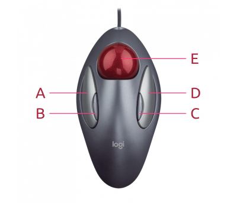

# What is this?

This is a daemon to enhance the features in the Logitech Trackball Marble in Linux. It contains a small script that maps its input info keys like Back, Forward, Scrolling and Alt+Tab.

# Usage



- A : Left click
- B : Middle click
- C : Right click
- E : Move cursor

- D + A : Alt + Tab
- D + B : Back
- D + C : Forward
- D + E : Vertical and horizontal scrolling

# Dependencies

This daemon requires python3, pip and evdev. It has only been tested in Ubuntu 20.04 LTS and you can install its dependencies with the following commands.

```shell
sudo apt update
sudo apt install -yq libpython3-dev
pip3 install evdev
```

# Install

```
sudo ./install.sh
```

# Uninstall

```
sudo ./uninstall.sh
```
