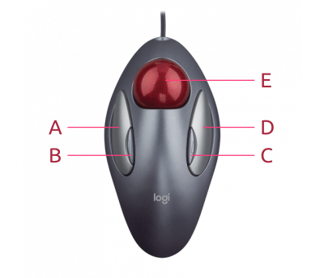
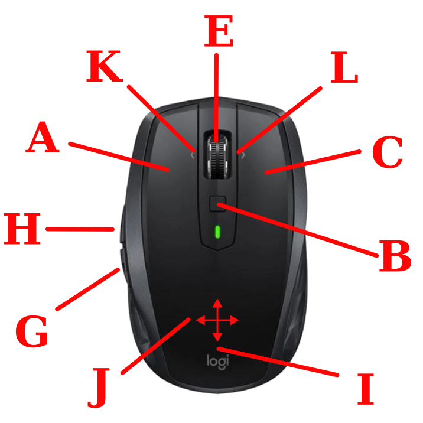
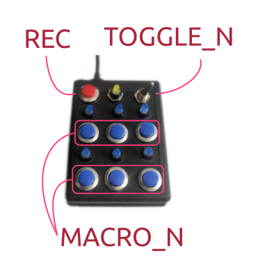
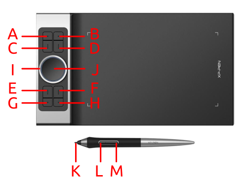
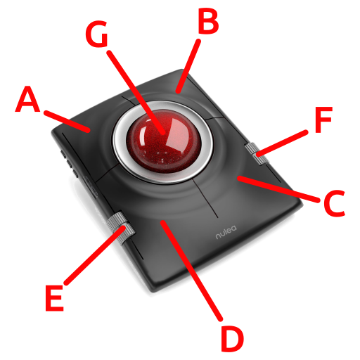
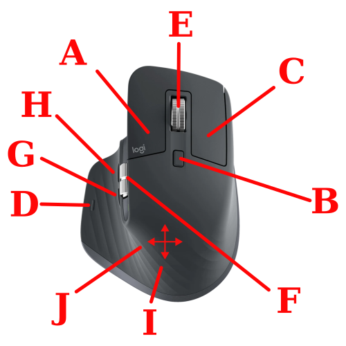

# What is this?

These is a system service to enhance the compatibility of the Logitech Trackball Marble, Logitech MX Anywhere 2S, and other devices I may have with the Linux OS. It contains scripts that start during system boot and map the device inputs into special commands, like Back, Forward, Scrolling, Alt+Tab, macros, and so on. If a device is not present/detected it simply ignores the enhancements. It is also aware of the current focused window. For instance, "Switch Tabs" will map to different shortcuts deppending on your app.


# Usage


## Logitech Trackball Marble




### Normal Mode

| Shortcut | Action                              |
| -------- | ----------------------------------- |
| A        | Left Click                          |
| B        | Go to Declaration / Open in new Tab |
| C        | Right Click                         |
| D        | Middle Click                        |
| E        | Move Cursor                         |


### Holding B

| Shortcut | Action                            |
| -------- | --------------------------------- |
| B + A    | Show All Windows                  |
| B + C    | Back                              |
| B + D    | Forward                           |
| B + E    | Vertical and Horizontal Scrolling |


### Holding C

| Shortcut | Action                                               |
| -------- | ---------------------------------------------------- |
| C + A    | Search Selection                                     |
| C + B    | Reopen Tab                                           |
| C + D    | New Tab or Document                                  |
| C + E    | Change Volume (Vertical) or Undo / Redo (Horizontal) |


### Holding D

| Shortcut | Action                                                |
| -------- | ----------------------------------------------------- |
| D + A    | Close Tab or Terminal                                 |
| D + B    | Close Window                                          |
| D + C    | Advanced Search: Tabs, Files, Content, Symbols, so on |
| D + E    | Switch Tabs (Vertical) or Switch Windows (Horizontal) |


## Logitech MX Anywhere 2S



Note: This is easily portable to the Logitech MX Anywhere 3S, but they sadly removed the two side wheel buttons, D and F. This means the loss of 10 shortcuts in total.

### Normal Mode

| Shortcut  | Action            |
| --------- | ----------------- |
| A         | Left Click        |
| B         | Middle Click      |
| C         | Right Click       |
| D         | Horizontal Scroll |
| E         | Vertical Scroll   |
| F         | Horizontal Scroll |
| H         | Back              |
| G         | Forward           |
| H + G - H | Focus Mode        |
| H + G - G | Show All Windows  |


### Holding H

| Shortcut | Action             |
| -------- | ------------------ |
| H + A    | Previous Workspace |
| H + B    | Close Tab          |
| H + C    | Next Workspace     |
| H + D    | Zoom In            |
| H + E    | Switch Tabs        |
| H + F    | Zoom Out           |


### Holding G

| Shortcut | Action            |
| -------- | ----------------- |
| G + A    | Go To Declaration |
| G + B    | Close Window      |
| G + C    | Search Selection  |
| G + D    | Redo              |
| G + E    | Switch Window     |
| G + F    | Undo              |


### Holding H + G

| Shortcut  | Action                            |
| --------- | --------------------------------- |
| H + G + A | Move Window to Previous Workspace |
| H + G + B | Reopen Tab                        |
| H + G + C | Move Window to Next Workspace     |
| H + G + D | Key Right                         |
| H + G + E | Keys Up / Down                    |
| H + G + F | Key Left                          |

### Holding G + H

| Shortcut  | Action           |
| --------- | ---------------- |
| G + H + A | Play / Pause     |
| G + H + B | Stop             |
| G + H + C | Mute / Unmute    |
| G + H + D | Next Track       |
| G + H + E | Volume Up / Down |
| G + H + F | Previous Track   |


## Macro Keyboard



| Shortcut               | Action                                                                                          |
| ---------------------- | ----------------------------------------------------------------------------------------------- |
| REC + MACRO_N          | Start recording / reset recording keyboard input sequence in buffer N (activates blue led)      |
| MACRO_N (blue led on)  | Finish recording the macro (deactivates led)                                                    |
| MACRO_N (blue led off) | Play the recorded sequence of keys                                                              |
| TOGGLE_N               | Toggle macro MACRO_N between two sets, MACRO_1 to MACRO_6 (left) or MACRO_7 to MACRO_12 (right) |
| Yellow led             | Indicates a key is being pressed                                                                |


## XPPEN Deco Pro



| Key | Mode          | Can draw? | Show drawing | Background |
| --- | ------------- | --------- | ------------ | ---------- |
| A   | Transparent   | Yes       | Yes          | None       |
| B   | Opaque        | Yes       | Yes          | Opaque     |
| C   | Passthrough   | No        | Yes          | None       |
| D   | Disabled      | No        | No           | None       |


### Transparent/Opaque/Passthrough Modes

| Key | Action                   |
| --- | ------------------------ |
| E   | Previous page            |
| F   | Next page                |
| G   | Undo                     |
| H   | Redo                     |
| I   | Change brush size        |
| J   | Move paper               |
| K   | Touch the tablet to draw |
| L   | Eraser mode              |
| M   | Open Menu (Planned)      |


### Disabled Mode

| Key | Action             |
| --- | ------------------ |
| E   | Planning           |
| F   | Planning           |
| G   | Planning           |
| H   | Planning           |
| I   | Planning           |
| J   | Planning           |
| K   | Left mouse click   |
| L   | Middle mouse click |
| M   | Right mouse click  |


## Nulea M512



### Normal Mode

| Shortcut | Action          |
| -------- | --------------- |
| A        | Middle Click    |
| C        | Right Click     |
| D        | Left Click      |
| E        | Change Tabs     |
| F        | Change Volume   |
| G        | Move Cursor     |


### Holding B

| Shortcut | Action                         |
| -------- | ------------------------------ |
| B + A    | Close Window                   |
| B + C    | Close Tab                      |
| B + D    | Play / Pause                   |
| B + E    | Change Windows                 |
| B + F    | Zoom In / Out                  |
| B + G    | Vertical and Horizontal Scroll |


## Logitech MX Master 3S



This shadow assumes logid is installed. Check the dependencies bellow on how to configure it.


### Normal Mode

| Shortcut | Action            |
| -------- | ----------------- |
| A        | Left Click        |
| B        | Middle Click      |
| C        | Right Click       |
| D        | Windows Key       |
| E        | Vertical Scroll   |
| F        | Horizontal Scroll |
| G        | Back              |
| H        | Forward           |


### Holding H

| Shortcut | Action             |
| -------- | ------------------ |
| H + A    | Previous Workspace |
| H + B    | Close Tab          |
| H + C    | Next Workspace     |
| H + E    | Switch Tabs        |


### Holding G

| Shortcut | Action            |
| -------- | ----------------- |
| G + A    | Go to Declaration |
| G + B    | Close Window      |
| G + C    | Search Selection  |
| G + E    | Switch Window     |


### Holding H + G

| Shortcut  | Action                            |
| --------- | --------------------------------- |
| H + G + A | Move Window To Previous Workspace |
| H + G + B | reopen Tab                        |
| H + G + C | Move Window To Next Workspace     |
| H + G + E | Zoom                              |


### Holding G + H

| Shortcut  | Action            |
| --------- | ----------------- |
| G + H + A | Play / Pause      |
| G + H + B | Stop              |
| G + H + C | Mute              |
| G + H + E | Volume            |


### Holding D

| Shortcut | Action     |
| -------- | ---------- |
| D + A    | Lock       |
| D + B    | Reopen Tab |
| D + C    | Power-off  |
| D + E    |            |
| D + H    | Ctrl+C     |
| D + G    | Ctrl+D     |


# Dependencies

This daemon requires python3, pip, evdev, inotifywait, xclip, edid-decode, and logiops/logid. It has only been tested in Ubuntu 24.04 LTS, you can install its dependencies with the following commands.

```shell
sudo apt update
sudo apt install -yq libpython3-dev inotify-tools xclip edid-decode
sudo pip3 install evdev
sudo apt install logiops # Only necessary if you use Logitech MX Master 3S
```

If you are using the Logitech MX Master 3S, you need to map its upper button (G) to the keyboard key KEY_B. Example Logid config file (***/etc/logid.cfg***):

```javascript
devices: ({
  name: "MX Master 3S";
  hiresscroll:
  {
        hires: true;
        invert: false;
        target: false;
  };
  smartshift:
  {
    on: false;
    threshold: 30;
    torque: 10;
  };
  dpi: 2000;

  buttons: (
    {
      cid: 0xc4;
      action: {
        type: "Keypress";
        keys: ["KEY_B"];
      };
    },
    {
      cid: 0x52;
      action = {
        type: "ToggleSmartShift";
      };
    }
  );
});
```


# Install

Install the python service and compiled programs

```shell

# Make sure your qmake is installed and accessible via PATH. For instance, qt creator would install it around your home directory:
sudo bash -c "PATH='/home/$USER/Qt/6.4.0/gcc_64/bin/':\$PATH ./install.sh"

# Start the service in the system
sudo service devstream start

# Activate autostart during system boot
sudo systemctl enable devstream
```


# Uninstall

```shell
# Stop services, uninstall them, and remove all files
sudo ./uninstall.sh
```
