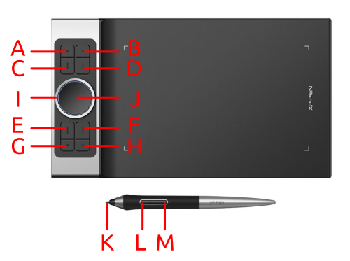

# What is this?

These is a system service to enhance the compatibility of the Logitech Trackball Marble, Logitech MX Anywhere 2S, and other devices I may have with the Linux OS. It contains scripts that start during system boot and map the device inputs into special commands, like Back, Forward, Scrolling, Alt+Tab, macros, and so on. If a device is not present/detected it simply ignores the enhancements. It is also aware of the current focused window. For instance, "Switch Tabs" will map to different shortcuts deppending on your app.

# Usage

## Logitech Trackball Marble


### Normal Mode

| Shortcut | Action                              |
| -------- | ----------------------------------- |
| A        | Left Click                          |
| B        | Go to Declaration / Open in new Tab |
| C        | Right Click                         |
| D        | Middle Click                        |
| E        | Move Cursor                         |

### Holding B

| Shortcut | Action                            |
| -------- | --------------------------------- |
| B + A    | Show All Windows                  |
| B + C    | Back                              |
| B + D    | Forward                           |
| B + E    | Vertical and Horizontal Scrolling |

### Holding C

| Shortcut | Action                                               |
| -------- | ---------------------------------------------------- |
| C + A    | Search Selection                                     |
| C + B    | Reopen Tab                                           |
| C + D    | New Tab or Document                                  |
| C + E    | Change Volume (Vertical) or Undo / Redo (Horizontal) |

### Holding D

| Shortcut | Action                                                |
| -------- | ----------------------------------------------------- |
| D + A    | Close Tab or Terminal                                 |
| D + B    | Close Window                                          |
| D + C    | Advanced Search: Tabs, Files, Content, Symbols, so on |
| D + E    | Switch Tabs (Vertical) or Switch Windows (Horizontal) |

## Logitech MX Anywhere 2S


### Normal Mode

| Shortcut | Action            |
| -------- | ----------------- |
| A        | Left Click        |
| B        | Middle Click      |
| C        | Right Click       |
| D        | Horizontal Scroll |
| E        | Vertical Scroll   |
| F        | Horizontal Scroll |
| H        | Back              |
| G        | Forward           |
| G + H    | Show All Windows  |

### Browser Mode

| Shortcut | Action            |
| -------- | ----------------- |
| H + A    | Go to Declaration |
| H + B    | Close Tab         |
| H + C    | Reopen Tab        |
| H + D    | Zoom In           |
| H + E    | Switch Tabs       |
| H + F    | Zoom Out          |

### System mode

| Shortcut | Action        |
| -------- | ------------- |
| G + A    | Undo          |
| G + B    | Close Window  |
| G + C    | Redo          |
| G + E    | Switch Window |

### Multimedia Mode

| Shortcut  | Action           |
| --------- | ---------------- |
| G + H + A | Play / Pause     |
| G + H + B | Stop             |
| G + H + C | Mute / Unmute    |
| G + H + D | Next Track       |
| G + H + E | Volume Up / Down |
| G + H + F | Previous Track   |

## Macro Keyboard


| Shortcut               | Action                                                                                          |
| ---------------------- | ----------------------------------------------------------------------------------------------- |
| REC + MACRO_N          | Start recording / reset recording keyboard input sequence in buffer N (activates blue led)      |
| MACRO_N (blue led on)  | Finish recording the macro (deactivates led)                                                    |
| MACRO_N (blue led off) | Play the recorded sequence of keys                                                              |
| TOGGLE_N               | Toggle macro MACRO_N between two sets, MACRO_1 to MACRO_6 (left) or MACRO_7 to MACRO_12 (right) |
| Yellow led             | Indicates a key is being pressed                                                                |


## XPPEN Deco Pro



| Key | Mode                                 |
| --- | ------------------------------------ |
| A   | Transparent canvas                   |
| B   | Opaque canvas                        |
| C   | Transparent canvas with passthrough  |
| D   | Disable entire canvas                |


### Transparent/Opaque/Passthrough modes

| Key | Action                   |
| --- | ------------------------ |
| E   | Previous page            |
| F   | Next page                |
| G   | Undo                     |
| H   | Redo                     |
| I   | Change brush size        |
| J   | Move paper               |
| K   | Touch the tablet to draw |
| L   | Eraser mode              |
| M   | Open Menu (Planned)      |

### Disabled mode

| Key | Action   |
| --- | -------- |
| E   | Planning |
| F   | Planning |
| G   | Planning |
| H   | Planning |
| I   | Planning |
| J   | Planning |
| K   | Planning |
| L   | Planning |
| M   | Planning |

# Dependencies

This daemon requires python3, pip, evdev, inotifywait, xclip and edid-decode. It has only been tested in Ubuntu 22.04 LTS, you can install its dependencies with the following commands.

```shell
sudo apt update
sudo apt install -yq libpython3-dev inotify-tools xclip edid-decode
sudo pip3 install evdev
```

# Install

Install the python service and compiled programs

```shell

# Make sure you qmake is installed and accessible via PATH. For instance, qt creator would install it around your home directory:
sudo bash -c "PATH='/home/$USER/Qt/6.4.0/gcc_64/bin/':\$PATH ./install.sh"

# Start the service in the system
sudo service devstream start

# Activate autostart during system boot
sudo systemctl enable devstream
```

# Uninstall

```shell
# Stop services, uninstall them, and remove all files
sudo ./uninstall.sh
```
